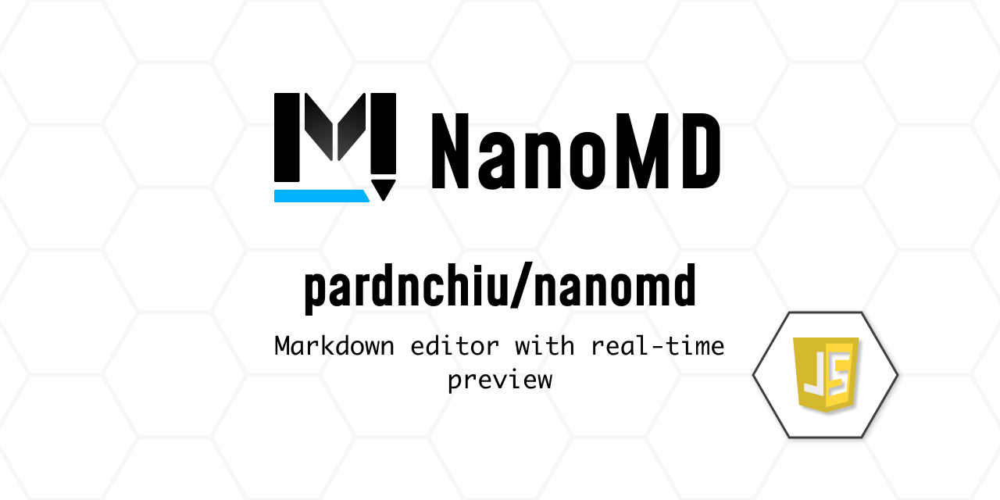

> [!NOTE]
> This README was translated by ChatGPT 4.1, get the original version from [here](./README.zh.md).



# NanoMD: Markdown Editor

[](https://www.npmjs.com/package/@pardnchiu/nanomd)
[](https://www.jsdelivr.com/package/npm/@pardnchiu/nanomd)

> NanoMD is a lightweight Markdown module based on vanilla JavaScript with native APIs.<br>
> Easily embeddable in websites, supports standard syntax, offers rich features, and provides real-time preview.

## Table of Contents
- [Core Features](#core-features)
  - [Real-time Editing & Preview](#real-time-editing--preview)
  - [Full Markdown Support](#full-markdown-support)
  - [Multimedia & Modular Architecture](#multimedia--modular-architecture)
- [Documentation](#documentation)
- [Installation](#installation)
  - [Install via npm](#install-via-npm)
  - [Import via CDN](#import-via-cdn)
    - [UMD Version](#umd-version)
    - [ES Module Version](#es-module-version)
- [Usage](#usage)
  - [Initialize MDEditor and MDViewer](#initialize-mdeditor-and-mdviewer)
- [Supplement](#supplement)
- [License](#license)
- [Developer](#developer)
- [Star](#star)

## Core Features

### Real-time Editing & Preview
- Virtual DOM update mechanism
- Split-screen real-time preview
- Synchronized scroll positioning

### Standard Markdown Support & Extensions
- Standard syntax support
- Code formatting and highlighting
- Automatic table formatting
- Task lists and blockquotes
- Mermaid rendering

### Multimedia & Modular Architecture
- YouTube, Vimeo video embedding
- Image thumbnail and size control
- Pure JavaScript implementation

## Documentation

- Website: [nanomd.pardn.io](https://nanomd.pardn.io)
- Docs: [nanomd.pardn.io/page/doc](https://nanomd.pardn.io/page/doc.html)
- Online Editor: [nanomd.pardn.io/page/live](https://nanomd.pardn.io/page/live.html)

## Installation

### Install via npm
```bash
npm i @pardnchiu/nanomd
```

### Import via CDN

#### UMD Version
```html
<!-- Version 1.8.0 and above -->
<script src="https://cdn.jsdelivr.net/npm/@pardnchiu/nanomd@[VERSION]/dist/NanoMD.js"></script>

<!-- Version 1.6.0-1.7.1 -->
<script src="https://cdn.jsdelivr.net/npm/pdmarkdownkit@[VERSION]/dist/PDMarkdownKit.js"></script>
```

#### ES Module Version
```javascript
// Version 1.8.0 and above
import { MDEditor, MDViewer, MDParser } from "https://cdn.jsdelivr.net/npm/@pardnchiu/nanomd@[VERSION]/dist/NanoMD.esm.js";

// Version 1.6.0-1.7.1
import { editor, viewer } from "https://cdn.jsdelivr.net/npm/pdmarkdownkit@[VERSION]/dist/PDMarkdownKit.module.js";

// Version 1.5.2 and below
import { editor, viewer } from "https://cdn.jsdelivr.net/npm/pdmarkdownkit@[VERSION]/dist/PDMarkdownKit.js";
```

## Usage

### Initialize `MDEditor` and `MDViewer`
```Javascript
// Version 1.8.0 and above
// Use: MDEditor, MDViewer

// Version 1.7.1 and below
// IIFE: PDMarkdownEditor, PDMarkdownViewer
// ESM: editor, viewer

const domEditor = new MDEditor({
  id: "",                                 // Target element to replace
  defaultContent: "",                     // Default content to display
  hotKey: 1,                              // Enable hotkeys, default: 1
  preventRefresh: 0,                      // Prevent page refresh, default: 0
  tabPin: 0,                              // Pin Tab, default: 0 (off)
  wrap: 1,                                // Enable word wrap, default: 1 (on)
  autosave: 1,                            // Autosave, default: 1 (on)
  event: {
    save: result => {                   // Custom save event
      console.log(result);            // Output current Markdown content
    },
    upload: async result => {
      /**
       * Custom image upload function
      *
      * Function:
      * - Allows developers to define image upload logic.
      * - After upload, returns an object with image link and alt text for insertion.
      *
      * Usage:
      * - Called when uploading images.
      * - Developers can define upload handling (e.g., upload to server via API).
      *
      * Return value:
      * - Must be an object with:
      *   - `href`: Image URL to insert.
      *   - `alt`: Alt text for the image.
      *
      * Example:
      * - Simulates 1 second delay and returns empty `href` and `alt`.
      * - Replace with real upload logic (e.g., using fetch or axios).
      */
      const link = await new Promise(resolve => {
        setTimeout(() => resolve({
          href: "",  // Image URL (replace with real upload result)
          alt: ""    // Alt text (replace with description)
        }), 1000);  // Simulate 1s delay
      });
      return link;
    }
  },
  style: {
    mode: "",                           // Theme mode: auto | light | dark, default: auto
    fill: 1,                            // Responsive to parent size, default: 1 (on)
    fontFamily: "",                     // Font, default: 'Noto Sans TC', sans-serif
    showRow: 0,                         // Show line numbers, default: 0 (off)
    placeholder: {
      text: "Content",                // Placeholder text, default: Type here ...
      color: "#ff000080"              // Placeholder color, default: #0000ff1a
    },
    focus: {
      backgroundColor: "#ff00001a",   // Focus background, default: #0000ffff
      color: "#ff0000"                // Focus text color, default: #bfbfbf
    }
  }
});

const domViewer = new MDViewer({
  id: "",                 // Target element to replace
  emptyContent: "",       // Default content when editor is empty
  style: {
    mode: "",           // auto | light | dark, default: auto
    fill: "",           // Responsive to parent size, default: 1 | true
    fontFamily: "",     // Default: 'Noto Sans TC', sans-serif
  },
  sync: {
    editor: domEditor,  // Associated editor
    delay: 50,          // Update delay in ms, default: 300
    scrollSync: 1,      // Sync scroll with editor, default: 0 | false
  },
  hashtag: {
    path: "?keyword=",  // Tag path, converts # to Link
    target: "_blank"    // Tag open mode, default: _blank
  }
});

// If not specifying a component, manually append to DOM
(...).appendChild(domEditor.body);
(...).appendChild(domViewer.body);

// Version 1.10.0 and above
const domParser = new MDParser({
  standard: 1             // Only support standard syntax, default: 1 | true
});

console.log(domParser.parse("**Text to parse**"))
```

## Supplement

- Formerly: PDMarkdownKit, renamed to NanoMD since version 1.8.0

## License

This project uses a MIT-like license, but only provides obfuscated code:
- Same as MIT: free use, modification, redistribution, including commercial use
- Main difference: only obfuscated code is provided by default, source code requires separate purchase
- License: must retain original copyright notice (same as MIT)

See [Software License Agreement](https://github.com/pardnchiu/NanoMD/blob/main/LICENSE) for details.

## Developer


<h4 style="padding-top: 0">Pardn Chiu</h4>

<a href="mailto:dev@pardn.io" target="_blank">

</a> <a href="https://linkedin.com/in/pardnchiu" target="_blank">

</a>

## Star

[](https://www.star-history.com/#pardnchiu/NanoMD&Date)

***

©️ 2023 [Pardn Chiu](https://pardn.io)

