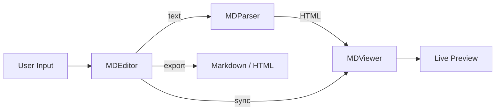

> [!NOTE]
> This README was generated by [SKILL](https://github.com/pardnchiu/skill-readme-generate), get the ZH version from [here](./README.zh.md).


# NanoMD

[](https://www.npmjs.com/package/@pardnchiu/nanomd)
[](https://www.jsdelivr.com/package/npm/@pardnchiu/nanomd)

> A lightweight Markdown editing, previewing, and parsing library built on pure JavaScript and native APIs, embeddable in any webpage without framework dependencies.

## Table of Contents

- [Features](#features)
- [Architecture](#architecture)
- [File Structure](#file-structure)
- [License](#license)
- [Author](#author)
- [Stars](#stars)

## Features

> `npm i @pardnchiu/nanomd` · [Documentation](./doc.md)

### Real-Time Editing with Split-Screen Preview

NanoMD includes a full-featured Markdown editor with live rendering and split-screen preview, enabling simultaneous writing and viewing. The editor provides undo/redo, keyboard shortcuts, and auto-indentation without requiring mode switching to verify the final output.

### Zero-Dependency Lightweight Design

Built entirely on native JavaScript and DOM APIs with no framework dependencies such as React or Vue. The minified bundle is extremely compact and can be imported into any web project via CDN or npm, minimizing integration cost and load overhead.

### Comprehensive Markdown Syntax Parsing

Supports headings, bold, italic, code blocks, tables, lists, blockquotes, image/video embeds, and Mermaid diagrams. Also provides hashtag linking, syntax highlighting, and file export (Markdown / HTML) as advanced features.

## Architecture


```mermaid
graph LR
    A[MDEditor] -->|text| B[MDParser]
    B -->|HTML| C[MDViewer]
    A -->|sync| C
    D[User Input] --> A
    C --> E[Live Preview]
    A -->|export| F[Markdown / HTML]
```

## File Structure

```
NanoMD/
├── dist/
│   ├── NanoMD.js              # Minified build
│   ├── NanoMD.esm.js          # ESM module
│   └── NanoMD.css             # Stylesheet
├── src/
│   ├── data.js                # Constants and configuration
│   ├── function/              # Parsing utilities
│   └── model/                 # Core classes
│       ├── editor.js          # MDEditor
│       ├── viewer.js          # MDViewer
│       └── parser.js          # MDParser
├── static/                    # Website assets
├── page/                      # Documentation pages
├── package.json
└── LICENSE
```

## License

This project is licensed under a custom [License Agreement](LICENSE).

## Author


<h4 style="padding-top: 0">邱敬幃 Pardn Chiu</h4>

<a href="mailto:dev@pardn.io" target="_blank">

</a> <a href="https://linkedin.com/in/pardnchiu" target="_blank">

</a>

## Stars

[](https://www.star-history.com/#pardnchiu/NanoMD&Date)

***

©️ 2024 [邱敬幃 Pardn Chiu](https://linkedin.com/in/pardnchiu)
