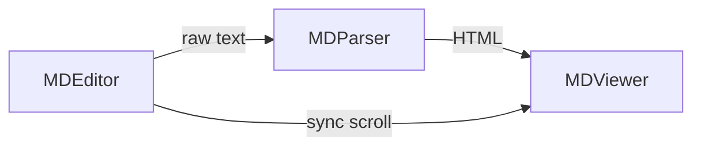

> [!NOTE]
> This README was generated by [SKILL](https://github.com/pardnchiu/skill-readme-generate), get the ZH version from [here](./doc/README.zh.md).

*** 

<p align="center">
<picture>

</picture>
</p>

<p align="center">
  <strong>LIGHTWEIGHT MARKDOWN PARSER!</strong>
</p>

<p align="center">
<a href="https://www.npmjs.com/package/@pardnchiu/nanomd"></a>
<a href="https://www.npmjs.com/package/@pardnchiu/nanomd"></a>
<a href="LICENSE"></a>
</p>

*** 

# NanoMD
> A pure JavaScript Markdown library with real-time split-screen editing, virtual DOM diffing, and zero-framework lightweight design

## Table of Contents

- [Features](#features)
- [Architecture](#architecture)
- [File Structure](#file-structure)
- [License](#license)
- [Author](#author)
- [Stars](#stars)

## Features

> `npm i @pardnchiu/nanomd` · [Documentation](./doc/doc.md)

### Real-Time Split-Screen Editing and Preview

Built-in MDEditor and MDViewer synchronization renders results instantly while writing, with configurable sync scrolling and render delay.

### Zero-Framework Lightweight Architecture

Built entirely on native JavaScript and DOM APIs without React, Vue, or any framework dependency, importable via CDN or npm with minimal bundle size.

### Three-Component Separation Design

MDEditor, MDViewer, and MDParser operate independently — use Parser alone for Markdown-to-HTML conversion or combine editor and viewer for full editing experience.

### Virtual DOM Diff Algorithm

Built-in vDOM diffing compares old and new node trees and patches only the changed parts, minimizing unnecessary DOM operations.

### Comprehensive Markdown Syntax Support

Covers headings, bold, italic, strikethrough, highlight, superscript, subscript, code blocks, tables, lists, blockquotes, checkboxes, and horizontal rules.

### Mermaid Diagram Rendering

Write Mermaid syntax directly in Markdown and get auto-rendered flowcharts, sequence diagrams, and other visualizations in the preview.

### Hashtag Linking

Supports `#hashtag` syntax that auto-converts to clickable links with customizable path prefix and open target.

### Code Syntax Highlighting

Provides syntax highlighting for over 20 programming languages including JavaScript, Python, Go, and Rust.

### Multi-Format Export

Export editor content as Markdown or HTML files, and import external Markdown files directly into the editor.

### Theme Switching and Auto-Detection

Supports Light, Dark, and Auto theme modes — Auto mode detects system preference and applies the corresponding theme.

### Editor Shortcuts and History

Built-in undo/redo history stack, keyboard shortcuts, auto-indentation, and pinnable toolbar for enhanced editing workflow.

## Architecture


```mermaid
graph LR
    A[MDEditor] -->|raw text| B[MDParser]
    B -->|HTML| C[MDViewer]
    A -->|sync scroll| C
```

> [Full architecture details](./doc/architecture.md)

## File Structure

```
NanoMD/
├── dist/
│   ├── NanoMD.js              # Minified build
│   ├── NanoMD.esm.js          # ESM module
│   ├── NanoMD.debug.js        # Debug build
│   └── NanoMD.css             # Stylesheet
├── src/
│   ├── data.js                # Constants, regex, and config
│   ├── function/              # Parsing utilities (30+ modules)
│   └── model/
│       ├── editor.js          # MDEditor core
│       ├── viewer.js          # MDViewer core
│       ├── parser.js          # MDParser core
│       ├── vDOM.js            # Virtual DOM diff algorithm
│       ├── editorHistory.js   # Undo / Redo management
│       ├── editorKeydown.js   # Shortcut handling
│       ├── editorCaret.js     # Cursor positioning
│       ├── editorSelection.js # Selection operations
│       ├── editorPanel.js     # Toolbar
│       └── editorTab.js       # Tab behavior
├── static/                    # Website assets
├── page/                      # Website pages
├── package.json
└── LICENSE
```

## License

This project is licensed under the [MIT LICENSE](LICENSE).

## Author


<h4 style="padding-top: 0">邱敬幃 Pardn Chiu</h4>

<a href="mailto:dev@pardn.io" target="_blank">

</a> <a href="https://linkedin.com/in/pardnchiu" target="_blank">

</a>

## Stars

[](https://www.star-history.com/#pardnchiu/NanoMD&Date)

***

©️ 2024 [邱敬幃 Pardn Chiu](https://linkedin.com/in/pardnchiu)
