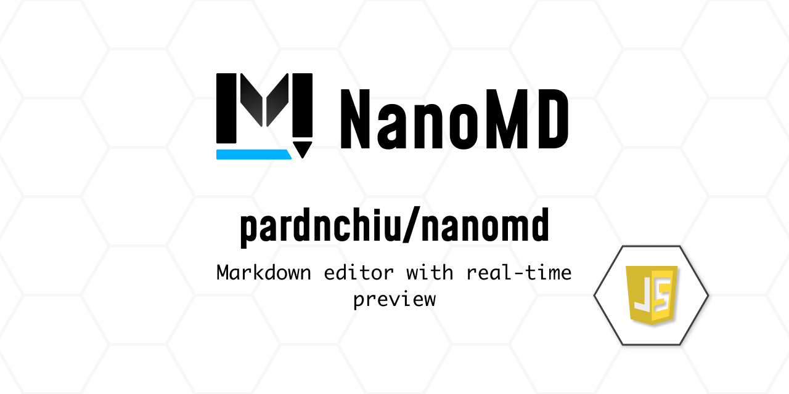
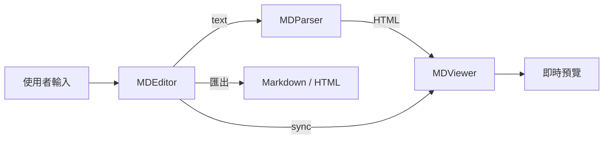

> [!NOTE]
> 此 README 由 [SKILL](https://github.com/pardnchiu/skill-readme-generate) 生成，英文版請參閱 [這裡](./README.md)。



# NanoMD

[](https://www.npmjs.com/package/@pardnchiu/nanomd)
[](https://www.jsdelivr.com/package/npm/@pardnchiu/nanomd)

> 基於純 JavaScript 與原生 API 的輕量級 Markdown 編輯、預覽與解析函式庫，無需任何框架即可嵌入網頁。

## 目錄

- [功能特點](#功能特點)
- [架構](#架構)
- [檔案結構](#檔案結構)
- [授權](#授權)
- [Author](#author)
- [Stars](#stars)

## 功能特點

> `npm i @pardnchiu/nanomd` · [完整文件](./doc.zh.md)

### 即時編輯與分屏預覽

NanoMD 內建完整的 Markdown 編輯器，支援即時渲染與分屏預覽，讓撰寫與檢視同步進行。編輯器提供 Undo/Redo、快捷鍵、自動縮排等功能，無需切換模式即可確認最終呈現效果。

### 零框架依賴的輕量設計

完全基於原生 JavaScript 與 DOM API 構建，無需 React、Vue 等框架依賴。壓縮後體積極小，可直接透過 CDN 或 npm 引入任何網頁專案，降低整合成本與載入負擔。

### 完整的 Markdown 語法解析

支援標題、粗體斜體、程式碼區塊、表格、清單、引用、圖片影片嵌入及 Mermaid 圖表等完整 Markdown 語法。同時提供 Hashtag 連結、代碼高亮與檔案匯出（Markdown / HTML）等進階功能。

## 架構



## 檔案結構

```
NanoMD/
├── dist/
│   ├── NanoMD.js              # 壓縮版
│   ├── NanoMD.esm.js          # ESM 模組
│   └── NanoMD.css             # 樣式表
├── src/
│   ├── data.js                # 常數與設定
│   ├── function/              # 解析工具函式
│   └── model/                 # 核心類別
│       ├── editor.js          # MDEditor
│       ├── viewer.js          # MDViewer
│       └── parser.js          # MDParser
├── static/                    # 網站靜態資源
├── page/                      # 文件頁面
├── package.json
└── LICENSE
```

## 授權

本專案採用自訂 [授權條款](LICENSE)。

## Author


<h4 style="padding-top: 0">邱敬幃 Pardn Chiu</h4>

<a href="mailto:dev@pardn.io" target="_blank">

</a> <a href="https://linkedin.com/in/pardnchiu" target="_blank">

</a>

## Stars

[](https://www.star-history.com/#pardnchiu/NanoMD&Date)

***

©️ 2024 [邱敬幃 Pardn Chiu](https://linkedin.com/in/pardnchiu)
