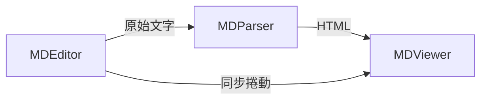

> [!NOTE]
> 此 README 由 [SKILL](https://github.com/pardnchiu/skill-readme-generate) 生成，英文版請參閱 [這裡](../README.md)。

*** 

<p align="center">
<picture>

</picture>
</p>

<p align="center">
  <strong>LIGHTWEIGHT MARKDOWN PARSER!</strong>
</p>

<p align="center">
<a href="https://www.npmjs.com/package/@pardnchiu/nanomd"></a>
<a href="https://www.npmjs.com/package/@pardnchiu/nanomd"></a>
<a href="../LICENSE"></a>
</p>

*** 


# NanoMD
> 純 JavaScript Markdown 函式庫，具備即時分屏編輯、虛擬 DOM 差異渲染與零框架依賴的輕量設計

## 目錄

- [功能特點](#功能特點)
- [架構](#架構)
- [檔案結構](#檔案結構)
- [授權](#授權)
- [Author](#author)
- [Stars](#stars)

## 功能特點

> `npm i @pardnchiu/nanomd` · [完整文件](./doc.zh.md)

### 即時分屏編輯與預覽

內建 MDEditor 與 MDViewer 同步機制，撰寫時即時渲染結果，支援同步捲動與可調延遲。

### 零框架依賴的輕量架構

完全基於原生 JavaScript 與 DOM API，無需 React、Vue 等框架，壓縮後極小可透過 CDN 或 npm 直接引入。

### 三元件分離設計

MDEditor、MDViewer、MDParser 各自獨立，可單獨使用 Parser 進行 Markdown 轉 HTML，也可組合編輯器與預覽器。

### 虛擬 DOM 差異比對

內建 vDOM 差異演算法，比對新舊節點樹後僅更新變動部分，減少不必要的 DOM 操作。

### 完整 Markdown 語法支援

涵蓋標題、粗體、斜體、刪除線、高亮、上下標、程式碼區塊、表格、清單、引用、核取方塊與水平線。

### Mermaid 圖表渲染

直接在 Markdown 中撰寫 Mermaid 語法，預覽時自動渲染為流程圖、序列圖等視覺化圖表。

### Hashtag 連結機制

支援 `#hashtag` 語法自動轉為可點擊連結，可自訂路徑前綴與開啟方式。

### 程式碼語法高亮

支援超過 20 種程式語言的語法高亮，包含 JavaScript、Python、Go、Rust 等主流語言。

### 多格式匯出

支援將編輯內容匯出為 Markdown 檔案或 HTML 檔案，也可從外部開啟 Markdown 檔案載入編輯器。

### 主題切換與自適應

支援 Light、Dark 與 Auto 三種主題模式，Auto 模式自動偵測系統偏好並套用對應主題。

### 編輯器快捷鍵與歷史紀錄

內建 Undo/Redo 歷史堆疊、鍵盤快捷鍵、自動縮排與 Tab 固定工具列等編輯輔助功能。

## 架構



> [完整架構細節](./architecture.zh.md)

## 檔案結構

```
NanoMD/
├── dist/
│   ├── NanoMD.js              # 壓縮版
│   ├── NanoMD.esm.js          # ESM 模組
│   ├── NanoMD.debug.js        # 除錯版
│   └── NanoMD.css             # 樣式表
├── src/
│   ├── data.js                # 常數、正規表達式與設定
│   ├── function/              # 解析工具函式（30+ 模組）
│   └── model/
│       ├── editor.js          # MDEditor 核心
│       ├── viewer.js          # MDViewer 核心
│       ├── parser.js          # MDParser 核心
│       ├── vDOM.js            # 虛擬 DOM 差異演算法
│       ├── editorHistory.js   # Undo / Redo 歷史管理
│       ├── editorKeydown.js   # 快捷鍵處理
│       ├── editorCaret.js     # 游標定位
│       ├── editorSelection.js # 選取操作
│       ├── editorPanel.js     # 工具列
│       └── editorTab.js       # Tab 行為
├── static/                    # 官網靜態資源
├── page/                      # 官網頁面
├── package.json
└── LICENSE
```

## 授權

本專案採用 [MIT LICENSE](../LICENSE)。

## Author


<h4 style="padding-top: 0">邱敬幃 Pardn Chiu</h4>

<a href="mailto:dev@pardn.io" target="_blank">

</a> <a href="https://linkedin.com/in/pardnchiu" target="_blank">

</a>

## Stars

[](https://www.star-history.com/#pardnchiu/NanoMD&Date)

***

©️ 2024 [邱敬幃 Pardn Chiu](https://linkedin.com/in/pardnchiu)
