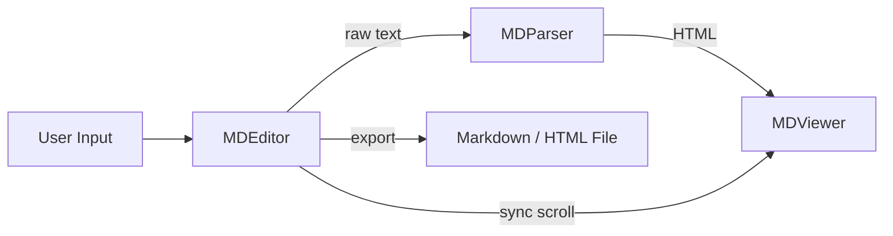
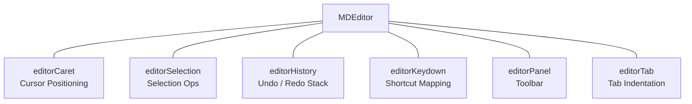
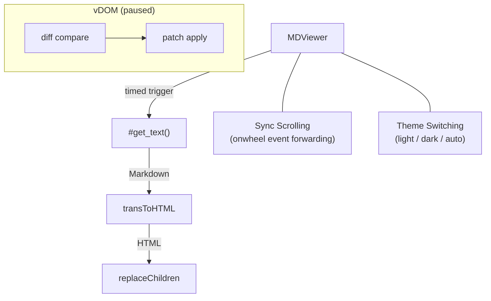
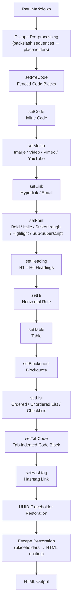
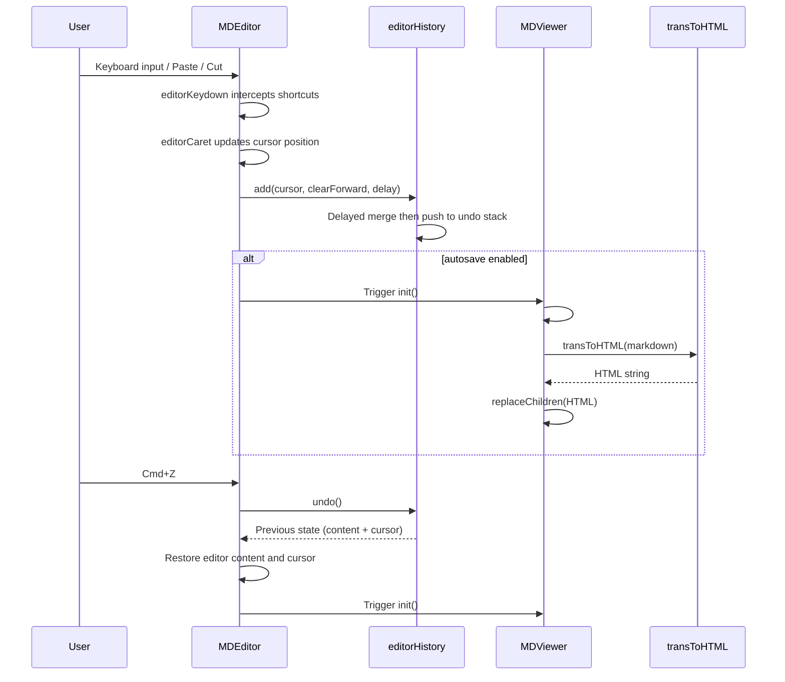
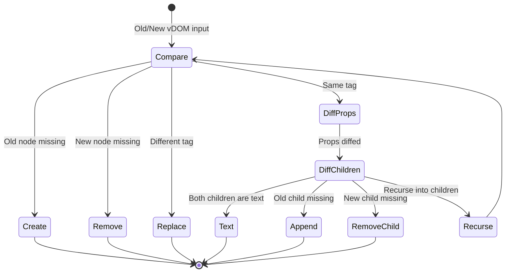
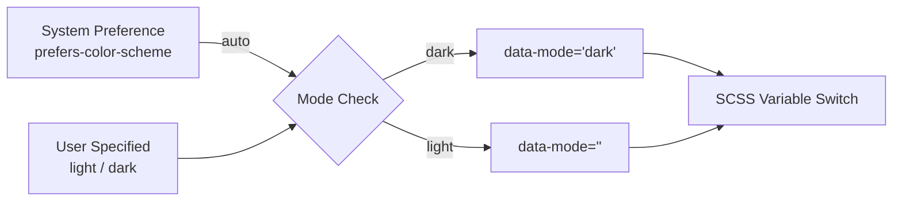

# NanoMD - Architecture

> Back to [README](../README.md)

## Overview

NanoMD consists of three core components: **MDEditor** (editor), **MDParser** (parser), and **MDViewer** (previewer). Users type raw Markdown in the Editor, the Parser pipeline converts it to HTML, and the Viewer renders the result to the DOM.

## Core Components

### MDEditor

Markdown editor responsible for user input, cursor management, shortcut handling, and history tracking.

| Module | Responsibility |
|--------|---------------|
| `editorCaret` | Track and set cursor position (row index and offset) |
| `editorSelection` | Handle multi-line selection, cut, and paste range calculation |
| `editorHistory` | Maintain undo/redo dual stacks with delayed writes to merge consecutive inputs |
| `editorKeydown` | Map keyboard combos (`Cmd+B`, `Cmd+Z`, etc.) to editor methods |
| `editorPanel` | Render top toolbar buttons and bind corresponding actions |
| `editorTab` | Handle Tab key indentation and de-indentation logic |

### MDParser

Standalone Markdown-to-HTML parser with no DOM dependency, usable independently.

Parser internally calls `transToHTML()`, which sequentially executes each transform function in the parsing pipeline.

### MDViewer

Live previewer that receives HTML and renders it to the DOM. Includes a built-in vDOM diffing mechanism (currently paused in favor of full replacement for rendering correctness).

## Parsing Pipeline

`transToHTML()` is the core of the entire parsing flow, calling the following transform functions in fixed order:

### Pipeline Order and Design Rationale

| Order | Function | Rationale |
|-------|----------|-----------|
| 1 | `setPreCode` | Fenced code blocks must be isolated first to prevent inner syntax from being misinterpreted |
| 2 | `setCode` | Inline code must be isolated before font formatting |
| 3 | `setMedia` | Image syntax `` resembles link syntax `` and must match first |
| 4 | `setLink` | Hyperlinks and email links |
| 5 | `setFont` | Bold, italic, and other inline formatting |
| 6 | `setHeading` | Headings must precede lists (`#` may appear inside list items) |
| 7 | `setHr` | Horizontal rules `---` must precede tables to avoid conflicts |
| 8 | `setTable` | Table parsing |
| 9 | `setBlockquote` | Blockquotes (nestable) |
| 10 | `setList` | Ordered/unordered lists and checkboxes |
| 11 | `setTabCode` | Tab-indented code blocks processed last to avoid list conflicts |
| 12 | `setHashtag` | Hashtag links as the final text transform |

### UUID Placeholder Mechanism

During parsing, processed HTML fragments are replaced with UUID placeholders (`{{uuid32}}`) to prevent re-parsing by subsequent steps. After all transforms complete, placeholders are restored to actual HTML.

### Standard Mode

When `standard: true`, the extended versions of `setPreCode`, `setMedia`, `setLink`, `setFont`, `setBlockquote`, and `setHashtag` are skipped. Only standard Markdown equivalents (`setLinkStandard`, `setFontStandard`, `setBlockquoteStandard`) are used.

## Editor Event Flow

## Virtual DOM Diffing

The vDOM module implements a lightweight diff algorithm that compares old and new node trees to produce minimal patch operations.

### Patch Operation Types

| Type | Description |
|------|-------------|
| `create` | Add new node |
| `remove` | Remove node |
| `replace` | Replace node (different tag) |
| `prop` | Update or remove attribute |
| `text` | Update text content |
| `append` | Append child node |

> The vDOM diffing is currently paused in favor of `replaceChildren()` full replacement to ensure rendering correctness. A future version plans to rewrite the diff algorithm to reduce DOM operations.

## Theme System

Editor and Viewer each maintain a `data-mode` attribute. SCSS uses `[data-mode="dark"]` selectors to switch color variables.

## Keyboard Shortcuts

| Combo | Action |
|-------|--------|
| `Cmd+B` | Bold |
| `Cmd+I` | Italic |
| `Cmd+Shift+X` | Strikethrough |
| `Cmd+U` | Underline |
| `Cmd+M` | Highlight marker |
| `Cmd+K` | Inline code |
| `Cmd+↑` | Superscript |
| `Cmd+↓` | Subscript |
| `Cmd+Z` | Undo |
| `Cmd+Shift+Z` | Redo |
| `Cmd+A` | Select all |
| `Cmd+S` | Save |
| `Cmd+]` | Indent |
| `Tab` | Insert indentation |

***

©️ 2024 [邱敬幃 Pardn Chiu](https://linkedin.com/in/pardnchiu)
