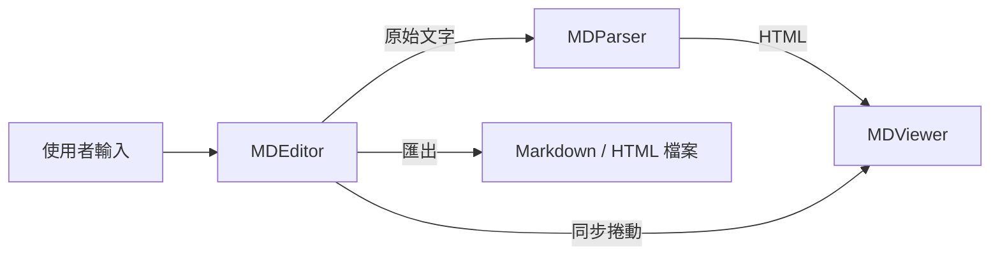
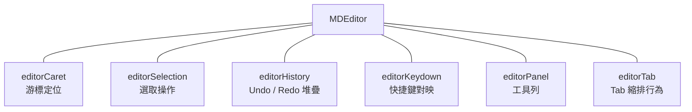
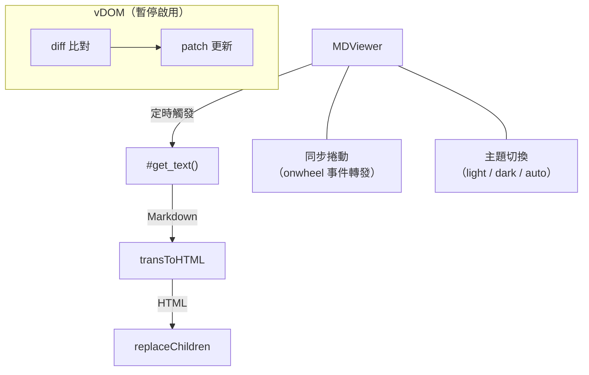
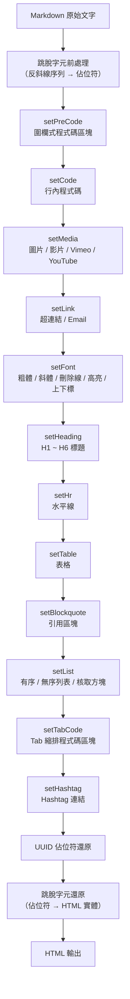
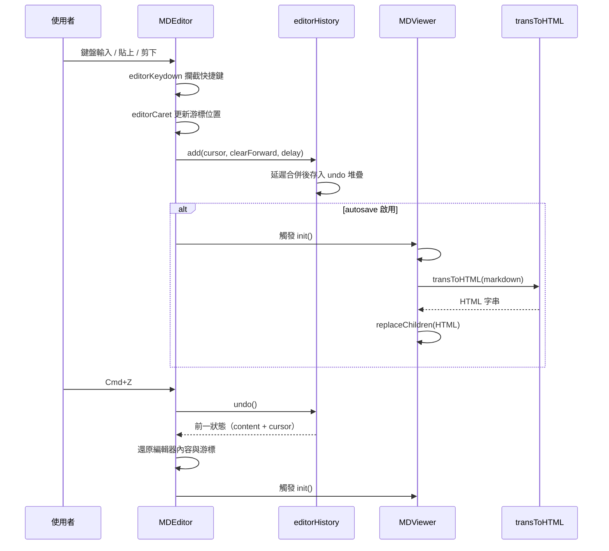
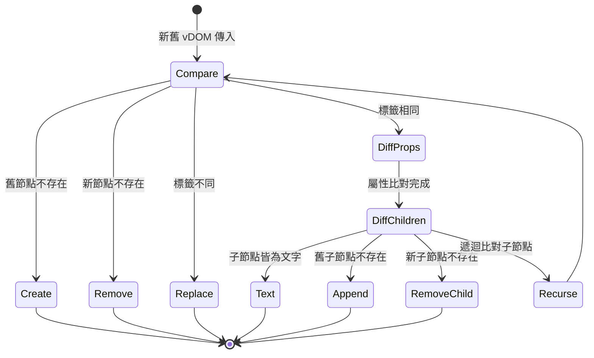
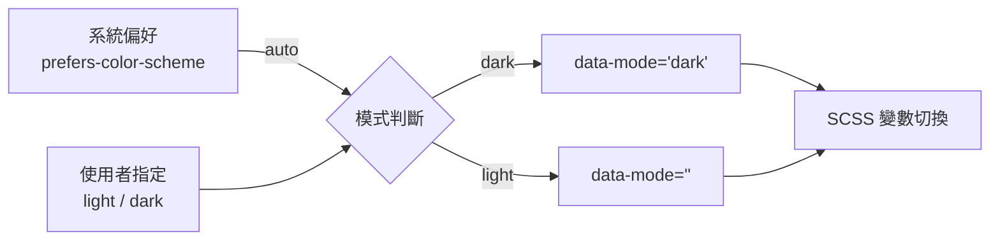

# NanoMD - 架構文件

> 返回 [README](./README.zh.md)

## 總覽

NanoMD 由三個核心元件組成：**MDEditor**（編輯器）、**MDParser**（解析器）、**MDViewer**（預覽器）。使用者在 Editor 中輸入 Markdown 原始文字，經由 Parser 的解析管線轉換為 HTML，最終由 Viewer 渲染至畫面。

## 核心元件

### MDEditor

Markdown 編輯器，負責使用者輸入、游標管理、快捷鍵處理與歷史紀錄。

| 模組 | 職責 |
|------|------|
| `editorCaret` | 追蹤與設定游標位置（行索引與偏移量） |
| `editorSelection` | 處理多行選取、剪下、貼上時的範圍計��� |
| `editorHistory` | 維護 undo/redo 雙堆疊，支援延遲寫入以合併連續輸入 |
| `editorKeydown` | 將鍵盤組合鍵（`Cmd+B`、`Cmd+Z` 等）對映至編輯器方法 |
| `editorPanel` | 渲染頂部工具列按鈕並綁定對應操作 |
| `editorTab` | 處理 Tab 鍵的縮排與反縮排邏輯 |

### MDParser

獨立的 Markdown 轉 HTML 解析器，不依賴 DOM，可單獨使用。

Parser 內部呼叫 `transToHTML()`，依序執行解析管線中的各個轉換函式。

### MDViewer

即時預覽器，接收 HTML 並渲染至 DOM。內建 vDOM 差異比對機制（目前暫停使用，改為全局替換以確保渲染正確性）。

## 解析管線

`transToHTML()` 是整個解析流程的核心，按固定順序呼叫以下轉換函式：

### 管線順序與設計考量

| 順序 | 函式 | 原因 |
|------|------|------|
| 1 | `setPreCode` | 優先處理圍欄式程式碼區塊，避免內部語法被後續步驟誤判 |
| 2 | `setCode` | 行內程式碼需在字型格式化前隔離 |
| 3 | `setMedia` | 圖片語法 ``  與連結語法 `` 相似，需先匹配 |
| 4 | `setLink` | 處理超連結與 Email 連結 |
| 5 | `setFont` | 粗體、斜體等行內格式化 |
| 6 | `setHeading` | 標題需在清單前處理（`#` 在清單內可能出現） |
| 7 | `setHr` | 水平線 `---` 需在表格前處理以避免衝突 |
| 8 | `setTable` | 表格解析 |
| 9 | `setBlockquote` | 引用區塊（可嵌套） |
| 10 | `setList` | 有序 / 無序列表與核取方塊 |
| 11 | `setTabCode` | Tab 縮排式程式碼區塊（最後處理以避免與清單衝突） |
| 12 | `setHashtag` | Hashtag 連結為最後一步文字轉換 |

### UUID 佔位符機制

解析過程中，已處理的 HTML 片段會被替換為 UUID 佔位符（`{{uuid32}}`），避免被後續步驟重複解析。所有轉換完成後，統一將佔位符還原為實際 HTML。

### 標準模式

當 `standard: true` 時，跳過 `setPreCode`、`setMedia`、`setLink`、`setFont`、`setBlockquote`、`setHashtag` 的擴充版本，僅使用標準 Markdown 語法對應的 `setLinkStandard`、`setFontStandard`、`setBlockquoteStandard`。

## 編輯器事件流

## 虛擬 DOM 差異比對

vDOM 模組實作了一套輕量級的差異演算法，用於比對新舊節點樹並產生最小化的 patch 操作。

### Patch 操作類型

| 類型 | 說明 |
|------|------|
| `create` | 新增節點 |
| `remove` | 移除節點 |
| `replace` | 替換節點（標籤不同） |
| `prop` | 更新或移除屬性 |
| `text` | 更新文字內容 |
| `append` | 附加子節點 |

> 目前 vDOM 差異比對已暫停啟用，改為 `replaceChildren()` 全局替換，以確保渲染正確性。未來版本計畫重寫差異演算法以減少 DOM 操作。

## 主題系統

Editor 與 Viewer 各自維護 `data-mode` 屬性，透過 SCSS 中的 `[data-mode="dark"]` 選擇器切換色彩變數。

## 快捷鍵對映

| 組合鍵 | 操作 |
|--------|------|
| `Cmd+B` | 粗體 |
| `Cmd+I` | 斜體 |
| `Cmd+Shift+X` | 刪除線 |
| `Cmd+U` | 底線 |
| `Cmd+M` | 高亮標記 |
| `Cmd+K` | 行內代碼 |
| `Cmd+↑` | 上標 |
| `Cmd+↓` | ��標 |
| `Cmd+Z` | 復原 |
| `Cmd+Shift+Z` | 重做 |
| `Cmd+A` | 全選 |
| `Cmd+S` | 儲存 |
| `Cmd+]` | 縮排 |
| `Tab` | 插入縮排 |

***

©️ 2024 [邱敬幃 Pardn Chiu](https://linkedin.com/in/pardnchiu)
