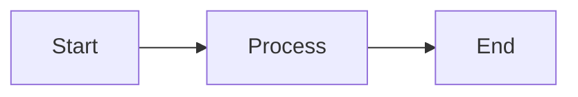

# NanoMD - Documentation

> Back to [README](../README.md)

## Prerequisites

- Node.js ≥ 22 (only required for development builds)
- Modern browser (Chrome, Firefox, Safari, Edge)

## Installation

### Using npm

```bash
npm i @pardnchiu/nanomd
```

### Using CDN

```html
<!-- Via jsDelivr -->
<link rel="stylesheet" href="https://cdn.jsdelivr.net/npm/@pardnchiu/nanomd@latest/dist/NanoMD.css">
<script src="https://cdn.jsdelivr.net/npm/@pardnchiu/nanomd@latest/dist/NanoMD.js"></script>
```

### ESM Module

```javascript
import { MDEditor, MDViewer, MDParser } from "@pardnchiu/nanomd";
```

### From Source

```bash
git clone https://github.com/pardnchiu/NanoMD.git
cd NanoMD
npm install
npm run build:once
```

## Usage

### Basic: Viewer Only

Create an MDViewer that renders Markdown as HTML:

```html
<section id="viewer"></section>

<script>
const viewer = new MDViewer({
    id: "viewer",
    emptyContent: "# Hello\n\nThis is **NanoMD**.",
    style: {
        mode: "auto",       // "auto" | "light" | "dark"
        fill: true,          // Fill parent container
        fontFamily: "sans-serif"
    }
});
</script>
```

### Basic: Editor + Viewer

Create a synchronized editor and viewer pair:

```html
<section id="editor"></section>
<section id="viewer"></section>

<script>
const editor = new MDEditor({
    id: "editor",
    defaultContent: "# Hello\n\nStart editing...",
    hotKey: true,           // Enable keyboard shortcuts
    autosave: true,         // Auto-sync to Viewer
    style: {
        mode: "auto",
        fill: true,
        showRow: true,       // Show line numbers
        placeholder: {
            text: "Type here ...",
            color: "#bfbfbf"
        },
        focus: {
            backgroundColor: "#0000ff1a",
            color: "#0000ffff"
        }
    }
});

const viewer = new MDViewer({
    id: "viewer",
    sync: {
        editor: editor,     // Bind to editor
        delay: 300,          // Render delay (ms)
        scroll: true         // Sync scrolling
    },
    style: {
        mode: "auto",
        fill: true
    }
});
</script>
```

### Advanced: Standalone MDParser

Parse Markdown to HTML without any DOM elements:

```javascript
const parser = new MDParser({
    standard: true   // Use standard Markdown parsing
});

const html = parser.parse("# Title\n\n**bold** and *italic*");
console.log(html);
```

### Advanced: Events and Export

```javascript
const editor = new MDEditor({
    id: "editor",
    event: {
        save: (text) => {
            // Custom save logic
            console.log("Content saved:", text);
        }
    }
});

// Programmatic operations
editor.bold(event);         // Insert bold
editor.heading(event, 2);   // Insert H2
editor.link("Title", "https://example.com"); // Insert link
editor.download("md");      // Export as Markdown
editor.download("html");    // Export as HTML
editor.undo();              // Undo
editor.redo();              // Redo
```

### Advanced: Hashtag Linking

```javascript
const viewer = new MDViewer({
    id: "viewer",
    hashtag: {
        path: "/tags/",     // Hashtag link path prefix
        target: "_blank"    // Link open target
    }
});
```

### Advanced: Mermaid Diagrams

Use Mermaid syntax blocks in Markdown for auto-rendered diagrams in preview:

````markdown

````

## API Reference

### MDEditor

```javascript
new MDEditor(config)
```

#### Constructor Options

| Parameter | Type | Default | Description |
|-----------|------|---------|-------------|
| `id` | `string` | - | Target DOM element ID |
| `defaultContent` | `string` | `""` | Initial Markdown content |
| `hotKey` | `boolean` | `true` | Enable keyboard shortcuts |
| `autosave` | `boolean` | `true` | Auto-sync to Viewer on input |
| `preventRefresh` | `boolean` | `false` | Prevent page refresh |
| `wrap` | `boolean` | `true` | Enable word wrap |
| `tabPin` | `boolean` | `false` | Pin toolbar |
| `style.mode` | `string` | `"auto"` | Theme: `"auto"` / `"light"` / `"dark"` |
| `style.fill` | `boolean` | `true` | Fill parent container |
| `style.showRow` | `boolean` | `true` | Show line numbers |
| `style.fontFamily` | `string` | `"'Roboto Mono', monospace"` | Editor font family |
| `style.placeholder.text` | `string` | `"Type here ..."` | Placeholder text |
| `style.placeholder.color` | `string` | `"#bfbfbf"` | Placeholder color |
| `style.focus.backgroundColor` | `string` | `"#0000ff1a"` | Focused line background |
| `style.focus.color` | `string` | `"#0000ffff"` | Focused line text color |
| `event.save` | `function` | - | Save callback, receives `text` |

#### Methods

| Method | Parameters | Description |
|--------|------------|-------------|
| `init(text?, withFocus?, set?)` | `string, boolean, boolean` | Initialize editor content |
| `heading(event, num)` | `Event, number(1-6)` | Insert heading |
| `bold(event)` | `Event` | Insert bold |
| `italic(event)` | `Event` | Insert italic |
| `strikethrough(event)` | `Event` | Insert strikethrough |
| `underline(event)` | `Event` | Insert underline |
| `marker(event)` | `Event` | Insert highlight marker |
| `sup(event)` | `Event` | Insert superscript |
| `sub(event)` | `Event` | Insert subscript |
| `code(event)` | `Event` | Insert code |
| `blockquote()` | - | Insert blockquote |
| `ul()` | - | Insert unordered list |
| `ol()` | - | Insert ordered list |
| `link(title, href)` | `string, string` | Insert hyperlink |
| `image(src, alt, title)` | `string, string, string` | Insert image |
| `download(type)` | `"md"` / `"html"` | Export file |
| `openfile(file)` | `File` | Open Markdown file |
| `undo()` | - | Undo |
| `redo()` | - | Redo |
| `save()` | - | Trigger save |
| `clear()` | - | Clear editor |
| `selectAll()` | - | Select all content |
| `changeMode(mode)` | `"light"` / `"dark"` | Switch theme |

#### Properties

| Property | Type | Description |
|----------|------|-------------|
| `text` | `string` (read-only) | Get editor plain text content |
| `viewer` | `MDViewer` | Bound Viewer instance |

### MDViewer

```javascript
new MDViewer(config)
```

#### Constructor Options

| Parameter | Type | Default | Description |
|-----------|------|---------|-------------|
| `id` | `string` | - | Target DOM element ID |
| `emptyContent` | `string` | `""` | Default Markdown content when no editor is bound |
| `style.mode` | `string` | `"auto"` | Theme mode |
| `style.fill` | `boolean` | `true` | Fill parent container |
| `style.fontFamily` | `string` | `"sans-serif"` | Viewer font family |
| `sync.editor` | `MDEditor` | `null` | Bound editor instance |
| `sync.delay` | `number` | `300` | Render delay (milliseconds) |
| `sync.scroll` | `boolean` | `false` | Sync scrolling |
| `hashtag.path` | `string` | `""` | Hashtag link path prefix |
| `hashtag.target` | `string` | `""` | Hashtag link open target |

#### Methods

| Method | Parameters | Description |
|--------|------------|-------------|
| `init(text?)` | `string` | Re-render content |
| `clear()` | - | Clear viewer |
| `changeMode(mode)` | `"light"` / `"dark"` | Switch theme |

#### Properties

| Property | Type | Description |
|----------|------|-------------|
| `editor` | `MDEditor` | Bound Editor instance |
| `body` | `HTMLElement` | Viewer DOM element |

### MDParser

```javascript
new MDParser(config)
```

#### Constructor Options

| Parameter | Type | Default | Description |
|-----------|------|---------|-------------|
| `standard` | `boolean` | `true` | Use standard Markdown parsing mode |
| `text` | `string` | `""` | Default Markdown text |

#### Methods

| Method | Parameters | Returns | Description |
|--------|------------|---------|-------------|
| `parse(text?)` | `string` | `string` | Convert Markdown to HTML string |

### Supported Markdown Syntax

| Syntax | Description |
|--------|-------------|
| `# ~ ######` | H1 – H6 headings |
| `**text**` | Bold |
| `*text*` | Italic |
| `~~text~~` | Strikethrough |
| `==text==` | Highlight marker |
| `^text^` | Superscript |
| `~text~` | Subscript |
| `` `code` `` | Inline code |
| ` ``` ` | Code block |
| `> text` | Blockquote |
| `- item` | Unordered list |
| `1. item` | Ordered list |
| `- [x] item` | Checkbox |
| `[text](url)` | Hyperlink |
| `` | Image |
| `---` | Horizontal rule |
| `\| table \|` | Table |
| `#hashtag` | Hashtag link |
| Mermaid block | Mermaid diagram |

***

©️ 2024 [邱敬幃 Pardn Chiu](https://linkedin.com/in/pardnchiu)
